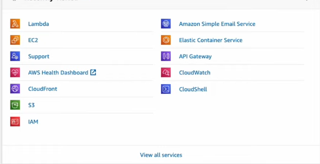

### **🚀 What is Serverless Framework?**  

**Serverless Framework** is a tool that makes it **easier** to deploy and manage serverless applications on **AWS Lambda, Azure Functions, Google Cloud Functions, and more.**  

---

## **🔥 Why Use Serverless Framework?**  
✅ **Easier deployment** → Just run `serverless deploy` instead of manually setting up AWS.  
✅ **Works with multiple cloud providers** → AWS, Google Cloud, Azure, etc.  
✅ **Automatic scaling** → Handles traffic spikes without extra setup.  
✅ **Reduced manual configuration** → No need to manually set up API Gateway, IAM roles, etc.  
✅ **Supports plugins & extensions** → Add monitoring, security, and logging easily.  

---

## **📌 How It Works (Example with AWS Lambda)**  

### **1️⃣ Install Serverless Framework**  
```sh
npm install -g serverless
```

### **2️⃣ Create a New Serverless Project**  
```sh
serverless create --template aws-nodejs --path my-serverless-app
cd my-serverless-app
```

### **3️⃣ Define Your Function in `serverless.yml`**  
```yaml
service: myServerlessApp

provider:
  name: aws
  runtime: nodejs18.x

functions:
  hello:
    handler: handler.hello
    events:
      - http:
          path: hello
          method: get
```

### **4️⃣ Write Your Function in `handler.js`**  
```js
module.exports.hello = async (event) => {
  return {
    statusCode: 200,
    body: JSON.stringify({ message: "Hello from Serverless Framework!" }),
  };
};
```

### **5️⃣ Deploy to AWS**  
```sh
serverless deploy
```

🎉 **Your function is now live!** You’ll get a **URL** to access it via API Gateway.  

---

## **💰 How is Cost Managed in Serverless Framework?**  
- **Same AWS Lambda pricing applies** (pay per invocation & execution time).  
- **Serverless Framework makes it easier** to optimize and track usage.  
- **No extra cost for using the framework itself.**  

---

## **🤔 Why Use Serverless Framework Over Manual AWS Setup?**  
| Feature                | AWS Manual Setup | Serverless Framework |
|------------------------|-----------------|----------------------|
| Deployment            | Manual           | **1 command** 🚀 |
| Scaling               | Auto             | Auto ✅ |
| Configuration         | Complex          | **Simple YAML file** |
| Multi-Cloud Support   | No               | **Yes** 🌍 |
| CI/CD Integration     | Hard             | **Easy** |

---

## **🎯 When to Use Serverless Framework?**  
✅ If you want **faster, easier serverless deployments**.  
✅ If you’re working with **multiple cloud providers** (AWS, Google, Azure).  
✅ If you want **automated scaling & monitoring** with minimal setup.  

---
### **🚀 How to Get AWS Access Keys (`AWS_ACCESS_KEY_ID`, `AWS_SECRET_ACCESS_KEY`)**  

To deploy a **Serverless Framework** project on AWS, you need AWS credentials. Follow these **step-by-step** instructions to generate your **AWS Access Key ID** and **AWS Secret Access Key**.  

---

### **📌 Step 1: Sign in to AWS Console**  
1. Go to [AWS Management Console](https://aws.amazon.com/console/).  
2. Log in with your AWS account.  

---

### **📌 Step 2: Open IAM (Identity and Access Management)**  
1. In the **AWS search bar**, type **IAM** and click on it.  
2. In the **left sidebar**, click on **Users**.  
3. Click **Create user**.  

---

### **📌 Step 3: Create a New User**  
1. Enter a **User name** (e.g., `serverless-user`).  
2. Check **Access key - Programmatic access**.  
3. Click **Next**.  

---

### **📌 Step 4: Attach Permissions**  
1. Choose **"Attach policies directly"**.  
2. Search for **AdministratorAccess** and select it.  
   - (Alternatively, use **AWSLambdaFullAccess** for limited permissions).  
3. Click **Next** and then **Create user**.  

---

### **📌 Step 5: Get AWS Access Keys**  
1. **After creating the user**, you’ll see **Access Key ID** and **Secret Access Key**.  
2. **Download the `.csv` file** or **copy the keys** (Secret Key **won't be shown again!**).  

---

### **📌 Step 6: Configure Serverless Framework with AWS Credentials**  
Now, set up your AWS keys on your local machine:

#### **Option 1: Using Serverless CLI**
Run:  
```sh
export AWS_SECRET_ACCESS_KEY=YOUR_SECRET_KEY
export AWS_ACCESS_KEY_ID=YOUR_ACCESS_KEY
```
---

### **🎉 Done! Now You’re Ready to Deploy 🚀**  
Now you can deploy your **serverless app** using:  
```sh
serverless deploy
```  
This will use your AWS credentials to deploy functions on AWS Lambda!  



```
…and **your API is live**! 🚀  
